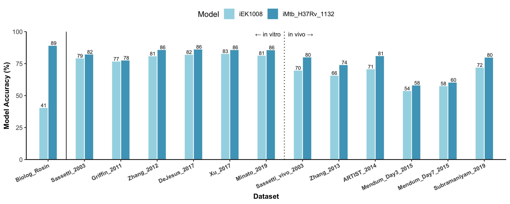

# iMtb_H37Rv_1132
iMtb_H37Rv_1132 is a constraint-based, genome-scale metabolic model of *Mycobacterium tuberculosis*.

*(note: Only a portion of this project is currently in the repository. Once the results are published, all scripts, data, etc. will be made publically-available.)*

## Project Overview
i) **Model Update**: To construct iMtb_H37Rv_1132, iEK1008<sup>1</sup> was updated with 211 new reactions, 112 new metabolites, and 133 new genes curated from literature on *M. tuberculosis* metabolism and scientific databases.


ii) **Model Validation**: Model performance metrics - accuracies and Matthew's Correlation Coefficients - were calculated for ten gene essentiality studies, a single Biolog phenotypic assay, and simulations of antibiotic-induced growth inhibition. These metrics were then compared between iEK1008 and iMtb_H37Rv_1132.



iii) **Model Application**: The expanded metabolic network that defines iMtb_H37Rv_1132 was evaluated for novel metabolic pathways with clinical significance. A malonate semialdehyde-mediated pathway was identified that allowed the model to overcome pyrazinamide-induced growth inhibition. Experimental verification of this novel pathway is recommended. 


## Requirements 
R 3.6.2

Python 3.7.4

COBRApy 0.16.0

Gurobi Optimizer 9.0.0

A complete list of Python dependencies can be found in ```requirements.txt```.

The required R packages will be installed automatically the first time a script is run.

## References
1. Kavvas, E. S. et al. Updated and standardized genome-scale reconstruction of Mycobacterium tuberculosis H37Rv, iEK1011, simulates flux states indicative of physiological conditions. *BMC Syst. Biol. 12, 25* (2018).

## How to Cite
publication in progress

## License 
